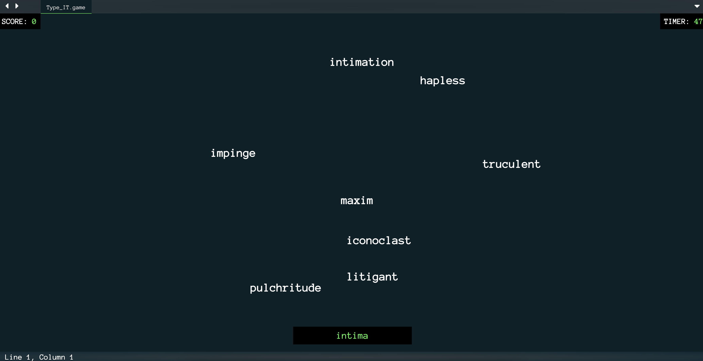
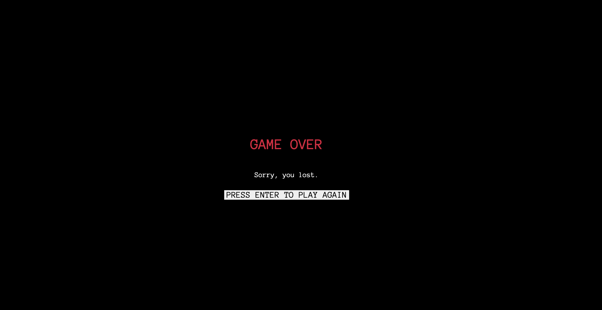

# Type It

A typing game where the goal is 2500 points before 10 words on screen. Longer words give more points. Tech stack includes JavaScript, jQuery, HTML and CSS.


## Demo

**Hosted Link:** https://type-it-quick.netlify.app/


## Features

- Multiple Animation Effects
- Score Along With Timer
- Clear Wrong Word By Pressing Enter


## Screenshots





## Tech Stack

**FrontEnd:** Bootstrap, HTML and CSS    
**Logic & Animation:** JavaScript and jQuery


## Run Locally

Clone the Project

```bash
  git clone https://github.com/AkshatPandey2006/Type_It
```

Open "index.html"


## Feedback

If you have any feedback, please reach out to me at akshat2006pandey@gmail.com

